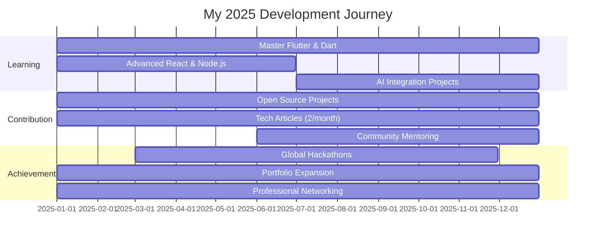

<div align="center">
  
# 🚀 Rensith Udara Gonalagoda
  
[](https://git.io/typing-svg)

<div align="center">
  
  
  
</div>


</div>

## 🎯 About Me


```yaml
Name: Rensith Udara Gonalagoda
Education: Bachelor of Software Engineering (Honors) - OUSL
Location: Sri Lanka �🇰
Status: Open for Opportunities
Passion: Creating Digital Solutions That Matter
```

🌟 **Currently Learning:** Advanced Web & Mobile Development with Flutter, React & Node.js  
🤝 **Open to Collaborate:** Full-stack projects, Mobile apps & Open-source contributions  
✍️ **Tech Writer:** Sharing knowledge on software engineering & coding best practices  
� **Ask me about:** Flutter, React, Node.js, Full-stack development & Mobile app architecture  
� **Contact:** [rensithudaragonalagoda@gmail.com](mailto:rensithudaragonalagoda@gmail.com)  
� **LinkedIn:** [Connect with me](https://linkedin.com/in/rensith-udara-gonalagoda)  
⚡ **Fun Fact:** I turn coffee into code and love solving complex problems! ☕→💻

<br clear="right"/>

## 🌐 Let's Connect

<div align="center">
  
[](https://linkedin.com/in/rensith-udara-gonalagoda)
[](https://instagram.com/rensithh.h/)
[](https://rensithudara.github.io/portfolio/)
[](mailto:rensithudaragonalagoda@gmail.com)

</div>

## 🛠️ Tech Stack & Skills

<div align="center">

### 💻 Frontend Development


### 📱 Mobile Development


### 🔧 Backend & Database


### 🎯 Programming Languages


### 🔨 Tools & Others


</div>


## 📊 GitHub Analytics

<div align="center">
  


</div>

<div align="center">
  
</div>


## 🎯 2025 Roadmap & Goals

<div align="center">



</div>

### 🏆 Key Objectives

| 🎯 Goal | 📅 Timeline | 📈 Progress |
|---------|-------------|-------------|
| **Master Flutter & Dart** | Jan - Dec 2025 |  |
| **Open Source Contributions** | Ongoing |  |
| **Full-Stack Projects with AI** | Jul - Dec 2025 |  |
| **Tech Articles (24 total)** | 2 per month |  |
| **Global Hackathons** | Mar - Nov 2025 |  |
| **Portfolio Enhancement** | Ongoing |  |


### 📎 Other Links:
- [My Portfolio](https://rensithudara.github.io/portfolio/)

### 🚀 Let’s Build Something Amazing Together!
Feel free to reach out if you're interested in collaborating on tech projects or just want to chat about the future of software development. 😄
